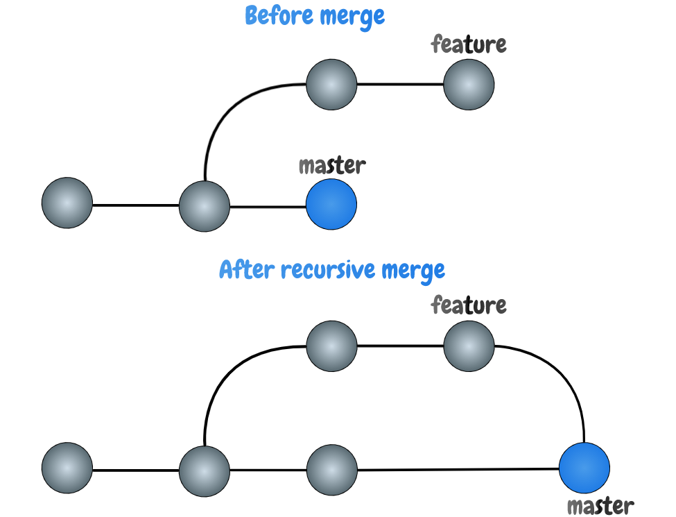

### **-GIT BASICS WORKSHOP-**

**1.** `Git basic Three Trees workflow`


#### This part is important for you to grasp because everything that follows will be easier for you to understand

#### There are three main parts that are maintained by _git_. (_.git directory (Repository)_, _Working Directory_ and _staging area_) _Working Direcotry_ holds the actual files that we can change and that are accessible to our IDE. _Working Direcotry_ is basically a particular version or snapshot of your project. _Index_ or staging area (Throughout this book, I will mostly us *Staging Area* term, but you should know that those are the same thing) is an area where changed files are prepared to be next commit objects, you can imagine staging area as a file that *git* uses to keep information about changed files that will be included in your next commit. _.git directory_ is a directory that _git_ uses to store all files that are committed and files that are in the staging area, it is simple key-value data store, whatever you commit _git_ will save it create unique key for it so that you can retrieve it later

#### So how these three parts are connected to one another. Let's see. When we start working on a feature we're starting from let's call it clean state - our *Working Directory* has same files that are tracked by git and that are present in our *.git directory (Repository)*, and our *Staging Area* is clean as well, we know that because git status command will tell us "nothing to commit, working tree clean". Then when we make some change add a new file or change existing file in our *Working Directory* git status will show those changed files painted in red which tell us that there is difference between files in our *Working Directory* and the files in the *Staging Area* which are files from the last commit that we made. Next, when we do git add we add those files to the *Staging Area* which are then ready to be committed. (Whenever you do git add command _git_ will keep track about those changes in *Index* file which is placed inside *.git directory (Repository)*). Later in this guide, I will show you how you can see all these file creations interactively using a few neat tricks in the command line). At this point, git status will tell us that we have some files ready to be committed and our *Working Directory* has files that are different from files in *.git directory (Repository)*. Now to complete this circle we have to commit files that have been changed using git commit command. Once we commit them a new commit object will be created in the *.git directory* and again we will have a clean state between these three parts. To go a bit deeper from here after we commit changes a new commit object is created which will be a new reference that _HEAD_ is pointing at. Now you are probably asking your self what the heck is _HEAD_, it is another thing that is important in the git world

#### _HEAD_ is a `symbolic reference` that points to the tip of the current branch that you are working on. I know it is fuzzy and probably that last sentence doesn't tell you much so I will try to explain it in a simple way. _HEAD_ is a reference that follows you wherever you are in your commit history, If you checkout to different branch _HEAD_ will follow you

---

**2.** `$ git init`

#### This command will create a new subdirectory `.git` inside the current directory that you've created for your project. This subdirectory is important for the _git_ and it is where _git_ stores all important objects and all its references. You can list all the directories and files inside .git directory using ls -la command and see what is in there, later on in the book meaning of some of the files that are present in .git directory will be explained

```bash
➜  git-basics git init
Initialized empty Git repository in /Users/nemanjavasic/Documents/git-basics/.git/
➜  git-basics git:(master) ls -la .git
total 24
drwxr-xr-x   9 nemanjavasic  staff  288 Jun 14 13:40 .
drwxr-xr-x   3 nemanjavasic  staff   96 Jun 14 13:40 ..
-rw-r--r--   1 nemanjavasic  staff   23 Jun 14 13:40 HEAD
-rw-r--r--   1 nemanjavasic  staff  137 Jun 14 13:40 config
-rw-r--r--   1 nemanjavasic  staff   73 Jun 14 13:40 description
drwxr-xr-x  13 nemanjavasic  staff  416 Jun 14 13:40 hooks
drwxr-xr-x   3 nemanjavasic  staff   96 Jun 14 13:40 info
drwxr-xr-x   4 nemanjavasic  staff  128 Jun 14 13:40 objects
drwxr-xr-x   4 nemanjavasic  staff  128 Jun 14 13:40 refs
```

---

**3.** `$ git clone <url-of-remote-repo>`

#### Command for downloading an existing Git repository to our local machine

---

**4.** `git-ignore`

#### `git-ignore` is the file where we can specify all folders and files that we don't want to track and that Git should ignore

---

**5.** `$ git add`

### Tracking new changes

#### `git add` is the command for adding new and changed files from the *Working Directory* to the *Staging Area*. One important thing here to understand is that _git add_ will not record any changes to your repository until you do _git commit_.  We can use

`$ git add .`

#### to add all changed and new files, or we can use

`$ git add <path-to-file>`

#### to add a specific file to the staging area

#### or you could also use regex to e.g. add all JavaScript files

`$ git add *.js`

#### Ok, let's see some examples, you remember how I promised that I will show you neat trick in the command line that you can use to see what is happening behind the scene

#### First open two command line windows and go to your project root directory in both terminals, then execute this script in one of them

`$ while; do; clear; tree .git; sleep 1; done;`

#### This is simple shell loop that will clear the screen, run `tree .git` command, wait for one second and repeat the process

#### Now assuming that you have newly initialized git repository you will see that _git_ repository tree is being displayed and cleared every second. Now if you, for example, add README.md file

`$ git add README.md`

#### you will see that new file called `index` was created, so what you've seen there is `README.md` file being added to the staging area and that is where _git_ is keeping information on all staged files

#### Next if you go further and commit that change you will see that a new directory has been created inside objects directory and also a new file with some hash as its name has been created. That file is the _git commit object_ and its hash name is unique SHA-1 that contains metadata on the commit that you've created. You can examine the content of the _git_ object by using `git cat-file -p <commit-hash>` command


---

**6.** `$ git status`

### git status is the command that can be used for see summary of all files that we have changed

---

**7.** `$ git commit`

#### git commit is the command for creating commit object (and associating meaningful log message that should describe the changes) that will live inside `.git` directory

#### Use `$ git commit -m` for adding commit message inline without opening editor

#### Use `$ git commit -a -m` to add changed files to staging area and to write commit message, (NOTE: `-a` argument will not add newly created files it will add only already existing changed files to staging area)

---

**7.1.** `rules of good commit message`

<https://gist.github.com/julienbourdeau/e605e4b8b47da97c249a0f72598529c8>

<https://chris.beams.io/posts/git-commit/>

---

**8.** `$ git commit --amend`

#### git commit --amend is the command that we can use to modify the most recent commit. It lets you combine staged changes with the previous commit instead of creating an entirely new commit

#### We can use`$ git commit --amend -m 'git-message'` or`git commit --amend --no-edit` to commit changed files with previous commit message

---

**9.** `$ git clean`

#### `git clean` is the command for deleting untracked files from our working directory

`$ git clean -f` - -f --force (Force is required unless in the git configuration variable clean.requireForce option is set to false)

`$ git clean -d` - -d is to include directories

---

**10.** `$ git branch`

#### git branch is command for working with Git branches

`$ git branch` - command for listing local branches

`$ git branch -a` - command to see all branches local and remote ones

`$ git branch -d <branch-name>` - command for deleting local branch

`$ git branch origin --delete <branch-name>` - command for deleting remote branch

`$ git branch -m <old-branch-name> <new-branch-name>` - command to rename local branch

---

**11.** `$ git checkout`

#### This is a command that you can use with files, commit objects and branches. It is commonly used for switching between branches, but you can use it also to discard changes in your working directory. When you use it to switch to different branch _git_ will update all files in your Working Directory to match the files that are present in that particular version of your application stored in the branch you switching to. When you checkout to the specific commit object then you're in detached HEAD mode - this is explained in Git basic Three Trees workflow section of the book. And when you use git checkout to checkout file _git_ will discard all unstaged changes to that file

#### to checkout to a different branch

`$ git checkout <branch-name>`

#### `-b` is a convenient option that lets as to create a new branch and then checkout to that branch

`$ git checkout -b <branch-name>`

#### Here are a few tips that you can use and that can speed up your every day work with _git_

#### Useful command to discard all changes made in all files

`$ git checkout -- .`

#### Useful command for switching to last checked out branch

`$ git checkout -`

---

**12.** `$ git fetch`

#### `git fetch` is command that downloads commits, branches, files from remote repository in our local repo, but it will not update our local repository state leaving our current work intact

---

**13.** `$ git merge`

#### `git merge` is command for integrating changes that have been made in remote or local branch into your current branch by creating new `merge commit`

`git merge <branch name>` where branch-name is the name of the branch that will be merged into the receiving branch.

#### There are several merge strategies but two main merge strateegies are `Fast Forward` and `Recursive Merge`

**13.1.** Fast Forward

#### With `Fast Forward` merge git history is a straight line without the need for a new merge commit. This strategy is the default one (but only when possible). Fast Forward strategy occurs in the case when you create a new branch e.g. `feature` from `master` branch and you make a few commits on `feature` branch, and by the time you are ready to merge those commits into `master` there is no any new commits on `master` branch and all that _git_ has to do is to move the HEAD pointer forward to the target branch. Let's see this on the image bellow


#### Lets see what is happening in `git log` using this cool script `git-log.sh`

 Thanks `Max Maintz` for providing this cool script

**13.2.** Recursive merge

#### Recursive merge strategy occurs when there is no linear path between the branches. This can happen if you've created a `feature` branch from the `master` branch, you've made some new commits and now you want to merge it into `master`. But, the difference is that in the meantime, someone updated the `master` branch and created some new commits there. Now, in order to merge the branches, __git__ has to combine changes into a new commit



#### Now look how new commit is created when there is no linear path between the branches


---

**14.** `$ git pull`

#### `git pull` is the command that is used to fetch content from remote repository and immediately update our local repository. It is combination of `git fetch` and `git merge`

---

**15.** `$ git push`

#### `git push` is the command for uploading local changes that we have made to a remote repositiry

`$ git push origin <branch-name>` - is the command that we can use when we want to push branch to the remote repository. _origin_ is essentially shorthand for the remote repository's URL. So, to push your changes to the remote repository, you could've used either the command: git push git@github.com:git/git.git yourbranchname or git push origin yourbranchname

`$ git push --force` - is the command that we can use to make the remote repository's branch match your local one. Only time where we should use this command is when we realize that commits that we shared to remote are not quite right and we want to fix the using `$ git commit --amend` command. When doing push force we need to be absolutely certain that none of our colleagues have pulled commits before using --force option

`$ git push --force-with-lease` => it will force the push with additional check if someone else did some changes on that branch

---

**16.** `Pull Requests`

_Example_:
53 - Add RookieService to handle all checks and calculation related to rookie

Summary of code changes:

1. Added RookieService class and implemented functionality to calculate remaining and current vacation days
2. Deleted unused code
3. Improved naming and fix typos

RookieService should update remaining vacation days and current vacation days for employees that are employed less than 6 months. For all other employees, the implementation should remain the same.

To test, set employment date to less than 6 months and try to add request view dashboard.

---

**17.** `$ git stash`

#### `git stash` command offers us option to temporarily store our uncommitted local changes, and switch to work on another branch

`$ git stash list` => shows list of all existing stashes

`$ git stash` => it will stash the changes in the memory

`$ git stash save <stash-message>` => atash changes with message

`$ git stash pop` => will take stashed change and also remove it from stash

`$ git stash apply` => will take stashed change but also keep it in stash

`$ git stash clean` => remove all stashed changes

---

**18.** `$ git log`

#### `$ git log` is command that allows as to review and to read history of all commits that are made in repository

`$ git log` => outputs the most basic log

`$ git log components` => output that is restricted to only specific directory

`$ git log feature` => output that is restricted to specific branch

`$ git log --oneline` => outputs history formated in one line

`$ git log --author` => outputs all commits by specific author

---

**19.** `$ git reset`

#### `git reset` is command for undoing changes. There is three forms of git reset, `--soft`, `--mixed`, `--hard`

`$ git reset --soft HEAD^` => will reset the last commit and put the changes in staged area ready to be committed

`$ git reset --mixed HEAD^` => will reset the last commit so that all changed files are preserved but not marked for commit (not in staging area). This is default git reset option

`$ git reset --hard HEAD^` => will completely remove last commit and all changes will be discarded

---

**20.** `$ git revert`

#### Another command that is used for undoing changes is `git revert` and this command creates a new commit which reverts commit that you've specified in the command, so you can probably notice a difference here between `git reset` command which moves HEAD and branch ref pointers, and `git revert` which creates a new revert commit, this also means that this command will not change project history which makes it safe operation for undoing changes.

---

**21.** `Alias`
#### git aliases that are really useful

```bash
git config --global alias.st status

git config --global alias.sts `status --short --branch`

git config --global alias.unstage 'reset HEAD --'

git config --global alias.undo 'reset HEAD~1 --mixed'

git config --global alias.co checkout

git config --global alias.cob 'checkout -b'

git config --global alias.br branch
```

---

**22.** `$ git reflog`

#### Reflog is just the log of all changes that you've made (Git keeps this logs 90 days by default)

---

## Usefull sites

<https://ohshitgit.com/>

<https://devhints.io/git-log>
